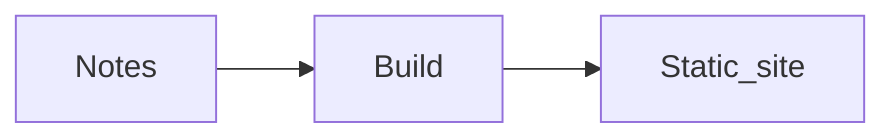

# Glorious Manta

A lightweight static blog built from Markdown with [Eleventy](https://www.11ty.dev/). No client-side framework.

## Write

Add posts to `content/posts`:

````md
---
title: A useful title
date: 2026-02-20 19:00:00
categories: [Microsoft Fabric, Spark]
tags: [fabric, spark]
---

Markdown, <mark>inline HTML</mark>, and Mermaid all work.


````

## Run locally

```sh
npm install
npm start
```

`npm run build` writes the static site to `_site`.

## Publish on Cloudflare Pages

Pushing to `main` runs `.github/workflows/deploy-pages.yml`. Create a Cloudflare Pages project, then add these repository settings in GitHub:

- Secret `CLOUDFLARE_API_TOKEN` — a token with **Cloudflare Pages: Edit** permission.
- Secret `CLOUDFLARE_ACCOUNT_ID` — the Cloudflare account ID.
- Variable `CLOUDFLARE_PAGES_PROJECT` — the Pages project name.

The workflow installs locked dependencies, builds `_site`, and deploys it to the production branch. Change the production URL in `_data/site.json` when attaching a custom domain.

## Blog workflow in Pi

Use a non-production branch for each post. The research artifacts live beside the post, but the date-prefixed Markdown file is the only published page:

```text
content/posts/<slug>/brief.md
content/posts/<slug>/evidence.jsonl
content/posts/<slug>/open-questions.md
content/posts/<slug>/review.md
content/posts/YYYY-MM-DD-<slug>.md
```

1. Create a branch, then create `content/posts/<slug>/brief.md` and start an interactive Pi session:

   ```sh
   git switch -c blog/<slug>
   mkdir -p content/posts/<slug>
   $EDITOR content/posts/<slug>/brief.md
   pi --name "blog <slug>"
   ```

2. Run `/skill:blog-research`, then `/skill:blog-draft`.
3. Run the review gate in a fresh, ephemeral Pi process after every edit. For lab-backed posts, load the ignored `.env` first so the child Pi process inherits the Fabric credentials:

   ```sh
   set -a
   source .env
   set +a

   for v in FAB_SP_TENANT_ID FAB_SP_CLIENT_ID FAB_SP_CLIENT_SECRET \
            AGENT_2_CLIENT_ID AGENT_2_CLIENT_SECRET SANDBOX_WORKSPACE_PREFIX; do
     [[ -n "${!v:-}" ]] && echo "$v=set" || echo "$v=MISSING"
   done

   POST=content/posts/YYYY-MM-DD-<slug>.md
   SLUG=<slug>
   pi --no-session --no-context-files --no-skills --no-approve \
     --skill ./.agents/skills/blog/blog-review/SKILL.md \
     --tools read,bash,write,edit,web_search,source_check,fetch_content,get_search_content \
     -p "Review $POST against content/posts/$SLUG/evidence.jsonl and content/posts/$SLUG/lab/. Write content/posts/$SLUG/review.md. Do not edit the post or commit anything."
   ```

   Never print the credential values or commit `.env`. In the main Pi session, read `review.md`, fix the BLOCK items, and rerun that command in a new process until it says `PASS`. A fresh process is more important than a fresh branch: it shares the working tree but has no research or drafting conversation.

4. After `PASS`, run `/skill:blog-release`. It builds the site, commits the post and evidence artifacts, and pushes the non-main branch. Merge it into `main` to publish through the GitHub Action.
