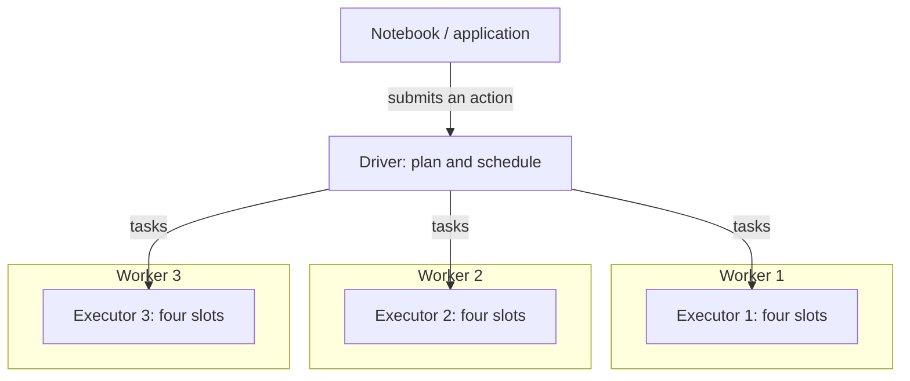
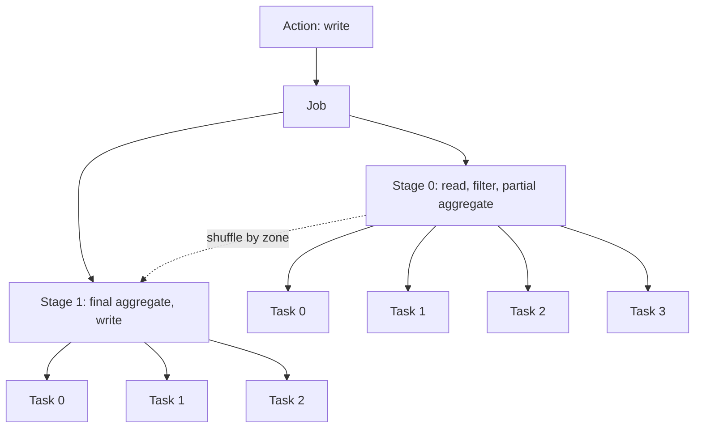

You run a notebook cell, open the Spark UI, and find jobs, stages, and hundreds of tasks. I start with the action that asked Spark to produce a result, then follow its job into stages and tasks. The Executors tab shows where those tasks run; the SQL tab explains the physical work behind them.

## The application and driver

A Spark application has a driver and one or more worker nodes. Your notebook uses a SparkSession to work with that application. The driver coordinates the execution: it analyzes and optimizes the plan, chooses physical operators, splits work into stages, and schedules tasks on executors. The executors on the workers process the partitions.



The Spark UI belongs to the application, which can contain many jobs. In the **Executors** tab, distinguish the driver entry from the executors doing the partition work. In Fabric, use **Live Spark UI** for a running application and **Spark History Server** for a completed or failed run.

## The action: asking Spark for a result

Transformations such as `select`, `filter`, and `groupBy` describe a computation. Spark evaluates them lazily: defining the pipeline does not ask Spark to finish it. An action such as `count()`, `show()`, `collect()`, or a write asks Spark to return a result or save output, triggering a job.

For example:

```python
trips = spark.read.table("trips")

(trips.filter("fare > 0")
      .groupBy("zone")
      .sum("fare")
      .write.saveAsTable("daily"))
```

The aggregation is a transformation. The final write is the action that triggers the work. In the **Jobs** tab, look for a description connected to that action, such as a write or count, rather than expecting one job for each line of the cell.

## The job: the request to do work

A job is the execution unit Spark creates for an action. Open **Jobs** to see the description, status, duration, and stage and task progress. I use the description to connect a row to my notebook, then open the job to inspect its stages. One SQL execution can create more than one job, so do not assume a one-to-one match between queries and job rows.

This simplified write example has two stages. An action creates the job, a shuffle starts a new stage, and each partition becomes a task within its stage:



The four input partitions and three output partitions illustrate this example; they are not fixed Spark defaults.

## The stage: work between shuffles

Within a stage, Spark can pipeline operations on a partition without redistributing records between partitions. In the example, tasks read, filter, and perform a partial aggregation. The `groupBy("zone")` requires a shuffle to bring records with the same zone together. After that boundary, the next stage finishes the aggregation and writes the result.

Find stages in the **Stages** tab or in the job's **DAG visualization**, the graph of stage dependencies. Look at durations, task counts, input and output sizes, and shuffle read and write volumes.


Aggregations, joins, repartitioning, and windows often introduce shuffle boundaries. A join's physical strategy determines whether it needs a shuffle; the presence of `join` in your code is not enough to tell. Use the SQL plan to check where Spark chose to move data.

## The task: one partition's work

A task applies the stage's logic to one partition. Two hundred partitions mean two hundred tasks for that stage, running the same code on different data. A task can perform several operations, such as reading, selecting, and filtering, without materializing a result between each one.

Open a **stage's detail page**, then inspect its **task table and timeline**. Compare task durations and data volumes. If most tasks finish in under half a second but one takes eight seconds, the stage must wait for that last task. A stage average can hide that difference.

I check the task table for skew and slow tasks, then inspect spill, garbage collection (GC), retries, and shuffle fetch wait. A long task is evidence to investigate, not enough on its own to name the cause.

## The executor: slots that run tasks

An executor is a worker JVM process that runs tasks. Its cores provide parallel slots; tasks wait if no slot is available. The rough relationship is:

```text
tasks in parallel ≈ executors × cores per executor
```

The topology above has three executors with four cores each, giving about twelve tasks at once. Two hundred tasks in a stage do not mean two hundred tasks running at the same time.

In **Executors**, compare active tasks, memory use, GC time, shuffle traffic, and failed tasks across workers. Open executor logs for more detail. Pressure concentrated on one executor can support a skew hypothesis. Pressure across the executors can indicate a shared stage cost, such as memory or shuffle pressure.

## The SQL tab: why the stage exists

The **SQL** tab, labelled **SQL / DataFrame** in the screenshot, covers SQL and DataFrame queries. Select an execution to inspect the physical plan and its operator metrics. Connect an expensive stage to the scan, join, aggregation, or write that produced the work.

Look for **Exchange** operators: these mark redistribution of data. In a sort-merge join plan with an Exchange on both inputs, Spark shuffles both datasets before the join. Those exchanges explain the stage boundaries you see in the job. Check the plan's operators and metrics before deciding which operation to change in the notebook.

## Fabric's monitoring views

In Fabric, open **Spark Application detail monitoring** from the **Monitoring Hub** or **Recent runs** panel for a first view of the application. Its Jobs tab shows job IDs, status, and code snippets. Resources shows executor usage; Logs gives access to process logs. Data contains input/output file information, and Item snapshots lets you inspect code and parameters from execution time. The Diagnostics panel provides Spark Advisor recommendations and error analysis.


For a completed run, open **Spark History Server** and select a Job ID. Fabric adds two investigation views:

- **Graph** shows the job DAG and stage flow. Switch between progress, read data, and written data, then select a stage node to open its details. Use this to locate where the work is concentrated; use SQL to explain the operators behind it.
- **Diagnosis**, labelled **Diagnostic (Preview)** in the screenshot, highlights Data Skew, Time Skew, and Executor Usage Analysis. Treat these as shortcuts to patterns you can check in task tables and executor timelines.

I follow the action into Jobs, open the costly stage, and compare its tasks. In Executors, I check where they ran; in SQL, I connect that runtime evidence back to the notebook. In the next post, *The Spark detective's field guide*, I'll use these views to investigate performance problems.
